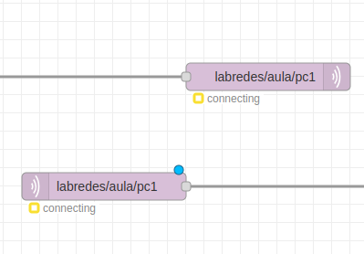
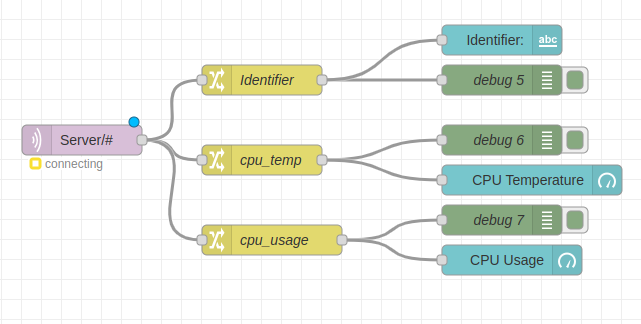
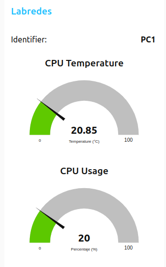

# Sistema de Monitoreo de IoT con MQTT, Node-RED, InfluxDB, Grafana y Home Assistant

## Resumen

El proyecto tiene como objetivo desarrollar un sistema completo de monitoreo de IoT que capture y almacene los datos de temperatura y uso de CPU de servidores, y proporcione visualizaciones en tiempo real y automatización a través de diferentes componentes. Se utilizarán tecnologías como MQTT, Node-RED del lado del servidor y python y bash del lado de los clientes.

Objetivo general: Implementar un sistema integral de monitoreo de IoT que permita capturar, almacenar y visualizar los datos de temperatura y uso de CPU de servidores.

En primer lugar, se configura un entorno de Docker y Docker compose con el fin de definir los servicios de Noder-Red y EMQX.
El archivo correspondiente a `docker-compose.yml` esta compuesto por dos partes principales debido a los dos servicios.

```yml
services:
  emqx:
    image: emqx:5.6.1     #imagen de Dokcer que se utilizará para el servicio
    container_name: emqx  #nombre del contenedor
    environment:          #creacion de variables de entorno para configurar el servicio
    - "EMQX_NODE_NAME=emqx@node1.emqx.io"   #nombre del nodo EMQX
    - "EMQX_CLUSTER__DISCOVERY_STRATEGY=static"   #estrategia de descubrimiento de clúster EMQX
    - "EMQX_CLUSTER__STATIC__SEEDS=[emqx@node1.emqx.io,emqx@node2.emqx.io]"   #nodos semilla del clúster EMQX
    healthcheck:  #comprobación de salud del contenedor
      test: ["CMD", "/opt/emqx/bin/emqx", "ctl", "status"]
      interval: 5s  #intervalo entre comprobaciones
      timeout: 25s  #tiempo maximo de espera para una comprobacion de salud
      retries: 5    #intentos de comprobación de salud
    networks:     #configuración de red
      emqx-bridge:
        aliases:
        - node1.emqx.io
    ports:      #mapeo de puertos
      - 1883:1883
      - 8083:8083
      - 8084:8084
      - 8883:8883
      - 18083:18083 

networks: #definicion de redes
  emqx-bridge:
    driver: bridge
```
En esta sección, se define un servicio llamado emqx que utiliza la imagen emqx:5.6.1, configura variables de entorno para el servicio EMQX, establece una comprobación de salud para el contenedor EMQX, configura la red para el contenedor y mapea los puertos entre el host y el contenedor. También define una red llamada emqx-bridge con el tipo de driver bridge.

Por otro lado, tenemos la parte del código referente al servicio de Node-Red.
```yml
services:
  node-red:
    image: nodered/node-red:latest # La imagen Docker que se utilizará para el servicio Node-RED, en este caso, la última versión disponible de Node-RED
    environment: # Variables de entorno para configurar el servicio Node-RED
      - TZ=Europe/Amsterdam
    ports: # Mapeo de puertos entre el host y el contenedor Node-RED
      - "1880:1880"
    networks: # Configuración de la red para el servicio Node-RED
      - node-red-net
    volumes: # Configuración de volúmenes para el servicio Node-RED
      - ./data:/data # Monta el directorio local './data' en el directorio '/data' dentro del contenedor

networks: #definicion de redes
  node-red-net:
    driver: bridge
```
En resumen, este archivo Docker Compose define un servicio llamado node-red que utiliza la imagen nodered/node-red:latest, configura la zona horaria del contenedor como Europe/Amsterdam, mapea el puerto 1880 del host al puerto 1880 del contenedor, asigna el servicio a una red llamada node-red-net, y monta el directorio local ./data en el directorio /data dentro del contenedor. Además, define una red llamada node-red-net con el tipo de driver bridge.

El archivo completo se encuentra en este repositorio: [docker-compose.yml](https://github.com/andresbuten2002/TCP_BKN/blob/main/actividades_dani_08052024/actividad_1/docker-compose.yml).

Posteriormente, se puede implementar el comando de Docker Compose para desplegar los contenedores de Node-Red y EMQX:
```bash
docker-compose up -d
```
Cabe mencionar de gran importancia dar permisos necesarios a la carpeta `/data` con la cual se creó el volumen.
```bash
sudo chmod o+w data
```

Una vez que ya se tienen los contenedores levantados y corriendo, se puede acceder al flujo de Node-Red para agregar publicadores y suscriptores según el tópico deseado.

Par acceder al mismo, en un navegador nos situamos en la dirección donde esta levantado el contenedor y el puerto 1880.

Para configurar las conexiones de los nodos de Node-Red a EMQX se necesita colocar la IP y el puerto del servidor, tal como se muestra en la imagen:


Esta configuración debe hacerse tanto para el nodo publicador como el suscriptor con el tópico correspondiente, el cual se ha elegido: `labredes/aula/pc1`.



Eso fueron las pruebas iniciales utilizando un timestamp que mandaba datos de tiempo y un debug para mostrar los mismos.

uego, se procedió a tomar datos de un publicador con un archivo de python que mide la temperatura y uso del CPU. El tópico al cual esta sucripto el nodo es: `Server/#`. 

El esquema de Node-Red es el siguiente:


El dashboard muestra las siguientes gráficas:


