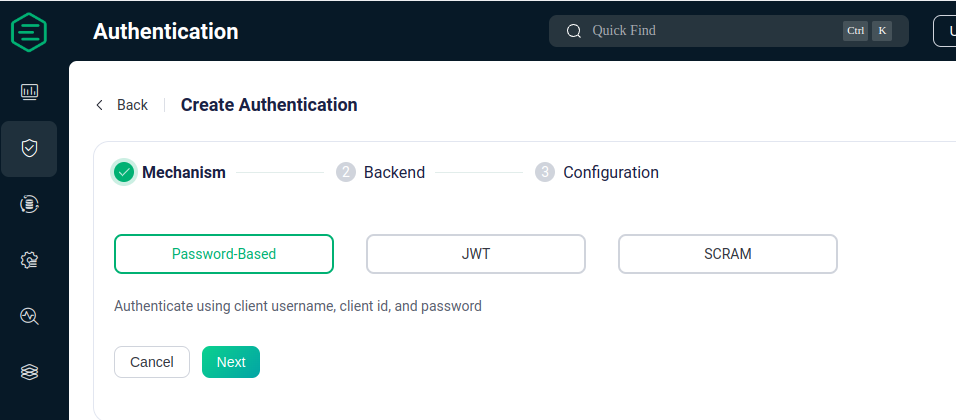
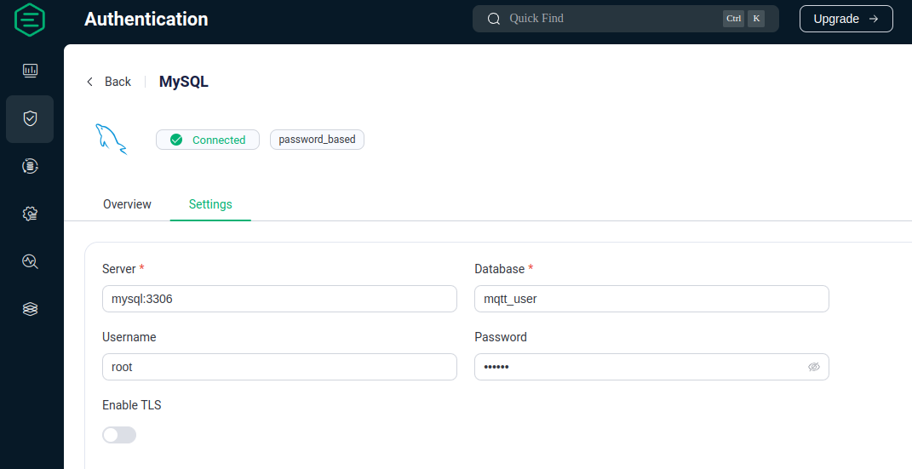
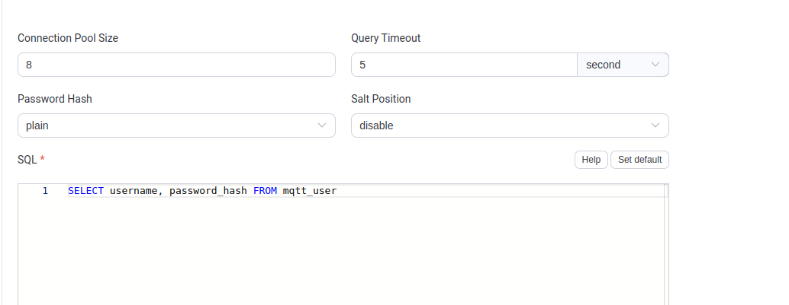

# Seguridad EMQX

# Autenticación con MySQL

Este documento describe los pasos necesarios para configurar la seguridad en EMQX utilizando MySQL para la autenticación y Portainer para la administración de contenedores Docker.

### Paso 1: Preparación de archivos y directorios

1. Crea un directorio para el proyecto:

    ```bash
    mkdir mi_proyecto
    cd mi_proyecto
    ```

2. Guarda los siguientes archivos en el directorio creado:
   - `docker-compose.yaml`
   - `init.sql`

3. Genera un directorio llamado `data` y otórgale permisos:

    ```bash
    mkdir data
    chmod 777 data
    ```

### Paso 2: Configuración de Docker

1. Crea una red Docker llamada `mi_red`:

    ```bash
    docker network create mi_red
    ```

2. Levanta los contenedores utilizando `docker-compose`:

    ```bash
    docker-compose up -d
    ```

### Paso 3: Verificación de la Configuración

1. Verifica que los contenedores se hayan levantado correctamente utilizando Portainer:

    ```bash
    docker volume create portainer_data
    docker run -d -p 9000:9000 -p 8000:8000 --name=portainer --restart=always \
        -v /var/run/docker.sock:/var/run/docker.sock \
        -v portainer_data:/data \
        portainer/portainer-ce
    ```

2. Accede a Portainer desde tu navegador web utilizando la dirección [http://localhost:9000](http://localhost:9000).

### Paso 4: Configuración del Dashboard EMQX para autenticación 

Accede al dashboard de EMQX desde [http://0.0.0.0:18083](http://0.0.0.0:18083).

1. Selecciona la opción de autenticación y haz clic en "create".
   
    

2. Selecciona "Password-Bassed" y luego "MySql". Configura de la siguiente forma:

    
    

Cuando se indica "password hash plain" en la configuración de EMQX para la autenticación con MySQL, significa que se utilizará un algoritmo de hash de contraseña "plain" para almacenar las contraseñas de los usuarios en la base de datos MySQL. El término "plain" en este contexto generalmente se refiere a que las contraseñas se almacenarán en texto plano, es decir, sin encriptación adicional.

# Certificacion

## Teoria del funcionamiento:

Los portocolos utilizados en este caso son TLS (Transport Layer Security) y SSL (Secure Sockets Layer) son protocolos criptográficos que proporcionan autenticación y cifrado de datos entre el cliente ( que puede ser pub o sub)  y el servidor (broker emqx).
Cuando nos referimos a que son protocolos criptograficos es por el hecho de que en este protocolo se busca garantizar lo siguiente a la hora de comunicarnos:

#### Confidencialidad
 Los datos transmitidos están cifrados, lo que significa que solo las partes autorizadas pueden entender el contenido de los mensajes. Esto se logra mediante algoritmos criptográficos que transforman los datos en un formato ilegible sin la clave de descifrado correspondiente.

#### Integridad 
TLS/SSL utilizan funciones criptográficas como hashes y firmas digitales para asegurar que los datos no sean alterados durante la transmisión. Esto garantiza que los destinatarios reciban los datos exactamente como fueron enviados, sin modificaciones no autorizadas.

#### Autenticación
 Los protocolos TLS/SSL permiten la autenticación de las partes involucradas en la comunicación mediante el uso de certificados digitales. Estos certificados son emitidos por autoridades de certificación y contienen claves públicas que pueden ser verificadas para confirmar la identidad del emisor.

#### Seguridad en la Comunicación
 En conjunto, estos principios criptográficos aseguran que las comunicaciones en redes, como las transacciones en línea, la transferencia de datos sensibles y la navegación web segura, estén protegidas contra la interceptación y la manipulación por parte de terceros malintencionados.


 #### Proceso de cifrado

El proceso de comunicación en el protocolo TLS/SSL consta de dos partes. La primera parte es el protocolo de handshake (saludo). El propósito de este protocolo de handshake es identificar la identidad de la otra parte y establecer un canal de comunicación seguro. Después del handshake, ambas partes negociarán la suite de cifrado y la clave de sesión para la comunicación siguiente. La segunda parte es el protocolo de record (registro). Record es muy similar a otros protocolos de transmisión de datos. Lleva tipos de contenido, versión, longitud, carga, etc., y la diferencia es que la información llevada por este protocolo está cifrada.

La siguiente imagen describe el proceso del protocolo de handshake de TLS/SSL, desde el "hello" (saludo) del cliente hasta el "finished" (terminado) del broker. 


#### Tipo de cifrado utilizado en este caso es "two- way"
La certificación bidireccional es que se requiere un certificado para el servicio y el cliente durante la autenticación de la conexión. Ambas partes deben realizar la autenticación para garantizar que se confíe en ambas partes involucradas en la comunicación. Ambas partes comparten sus certificados públicos y luego realizan la verificación y confirmación en función del certificado

## Pasos de la configuracion 

#### creacion de certificados

En primer lugar creo en mi_proyecto un directorio llamado certs y  me posisiono dentro de esa carpeta.

```bash
    mkdir certs
```
le doy a esa carpeta todos los permisos:
```bash
    chmod 777 certs
```
instalo open SSL

```bash
    sudo apt install openssl
```
Genero el certificado ca.pem autofirmado:

primero genero clave privada para firmarlo:
```bash
    openssl genrsa -out ca.key 2048
```
luego lo creo 
```bash
   openssl req -x509 -new -nodes -key ca.key -sha256 -days 3650 -out ca.pem   
```
Ahora genero certificados para el servidor (emqx)

en principio clave privada:
```bash
    openssl genrsa -out emqx.key 2048
```
luego creo archivo openssl.cnf 
```bash
    touch openssl.cnf 
```
```bash
    nano openssl.cnf 
```
lo edito con el siguiente archivo cambio SOLO donde dice broker_address, alli pongo la direccion ip de mi emqx :
```bash
    [req]
default_bits  = 2048
distinguished_name = req_distinguished_name
req_extensions = req_ext
x509_extensions = v3_req
prompt = no
[req_distinguished_name]
countryName = CN
stateOrProvinceName = Zhejiang
localityName = Hangzhou
organizationName = EMQX
commonName = CA
[req_ext]
subjectAltName = @alt_names
[v3_req]
subjectAltName = @alt_names
[alt_names]
IP.1 = BROKER_ADDRESS
DNS.1 = BROKER_ADDRESS

```
luego uso esa clave y configuracion para solicitar un certificado 

```bash
   openssl req -new -key ./emqx.key -config openssl.cnf -out emqx.csr

```
por ultimo uso el ca.pem para generar el certificado de emqx:

```bash
    openssl x509 -req -in ./emqx.csr -CA ca.pem -CAkey ca.key -CAcreateserial -out emqx.pem -days 3650 -sha256 -extensions v3_req -extfile openssl.cnf

```
Luego genero certificado del cliente 
clave del cliente:
```bash
   openssl genrsa -out client.key 2048

```
archivo de solicitud de cliente: 
```bash
   openssl req -new -key client.key -out client.csr -subj "/C=CN/ST=Zhejiang/L=Hangzhou/O=EMQX/CN=client"

```

firmo y genero certificado de cliente: 
```bash
   openssl x509 -req -days 3650 -in client.csr -CA ca.pem -CAkey ca.key -CAcreateserial -out client.pem

```
#### configuracion del dashboard
Dentro de "Listeners" en la columna izquierda, selecciona el listener por default para SSL.


Carga los archivos de encriptación en el siguiente orden: `emqx.pem`, `emqx.key`, `ca.pem`, luego presiona "Update".
 y pongo Force Verify Peer Certificate en true y habilito verify Peer

Por otro lado, cuando el cliente mqtt genera la publicacion o subcripcion utilizo: cliente.pem, cliente.key y ca.pem 

