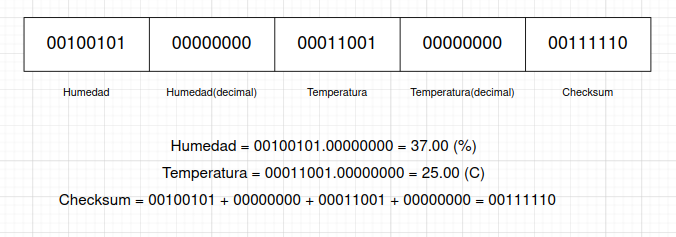
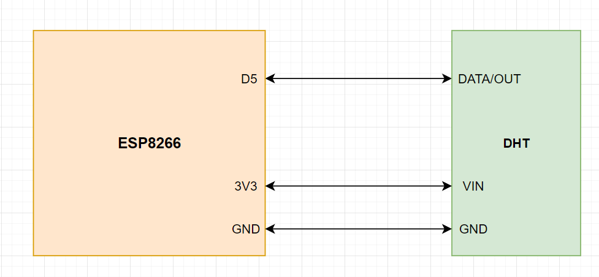
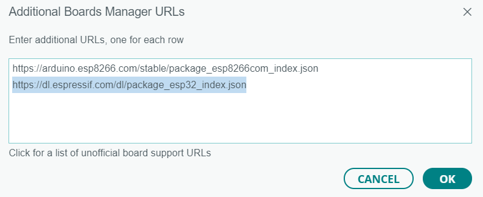

# 
 WEMOS LOLIN D1 mini - Sensor de Humedad, temperatura y presion DHT12

  

## Introduccion

En esta seccion se detalla brevemente como realizar mediciones de humedad, temperatura y presion del ambiente utilizando el sensor DHT12 (WEMOS Shield) en conjunto con el microcontrolador WEMOS LOLIN D1 mini y posteriormente enviar los datos obtenidos a un servidor MQTT.  

## Que es el microcontrolador LOLIN D1 mini?

El dispositivo LOLIN D1 mini es un microcontrolador compacto que cuenta con una placa WiFi con 4MB de memoria flash y esta basado en la arquitectura ESP-8266EX. Ademas cuenta con 11 pines entrada/salida digitales, 1 pin de entrada analogica (maximo de tension de 3.2V), puerto de USB tipo USB-C, puerto de I2C y compatibilidad con MicroPython o Arduino.
[(Documentacion oficial LOLIN D1 mini)](https://docs.wemos.cc/en/latest/d1/d1_mini.html) 

## El sensor DHT11/DHT12

#### Resumen General

Los sensores DHT estan compuestos de dos partes, un sensor de humedad capacitivo y un termistor. Tambien incluyen un chip con una logica interna que permite realizar la conversion de datos analogicos a digitales lo que devuelve señales digitales de temperatura y humedad, que pueden ser leidas facilmente por cualquier microcontrolador. Particularmente, el sensor DHT11 cuenta con una entrada de tension de alimentacion de 3V a 5V, y un pin de salida digital. Este sensor realiza mediciones de humedad de entre el 20-80% con error de precision del 5%, y mediciones de temperatura de 0-50°C con error de precision de ±2°C. Ademas cuenta con una tasa de muestreo de 1 Hz, lo que permite realizar un maximo de una medicion por segundo.

#### Conversion de datos:

Los sensores DHT, tras realizar la medicion de temperatura y humedad, convierten los datos analogicos digitales mediante un ADC interno en el dispositivo. El formato de dato es de 40 bits, y puede ser interpretado y convertido a decimal facilmente por dispositivos como Arduino utilizando las librerias adecuadas. Los 40 bits de informacion digital estan seccionados de la siguiente forma:

#### El protococolo I²C:

El protocolo I²C (Circuito Inter-Integrado) está diseñado como un bus maestro-esclavo. La transferencia de datos es siempre inicializada por un maestro; el esclavo reacciona. Es posible tener varios maestros mediante un modo multimaestro, en el que se pueden comunicar dos maestros entre sí, de modo que uno de ellos trabaja como esclavo. El arbitraje (control de acceso en el bus) se rige por las especificaciones, de este modo los maestros pueden ir turnándose. La comunicacion se realiza a traves de una señal de reloj **(SCL)**, que siempre es generada por el maestro. Ademas se cuenta con con cable extra, por el cual se realiza la escritura/lectura de datos de manera serial **(SDA)**. En algunos tipos de comunicacion I²C no es necesario utilizar 2 los dos cables (SDA y SCL) y se puede utilizar el protocolo con solamente uno de los dos cables (SDA). Al usar un unico cable, se limita el protocolo a un solo maestro-esclavo y ademas es una comunicacion mas lenta y de menor alcance (metros) en comparacion con I²C de dos cables, que se trata de una comunicacion mas rapida, de mayor alcance y que permite multiples maestros. 

#### DHT11 vs. DHT12:
 
Si bien las especificaciones tecnicas son similares, la diferencia entre version de DHT radica en los pines y la implementacion del protocolo I²C:
 - **DHT11:** Cuenta fisicamente con dos pines, pero uno de los dos (SCL) no se utiliza ya que no esta conectado logicamente al dispositivo.
 - **DHT12:** A diferencia del DHT11, este cuenta con los dos pines SCL y SDA lo que permite realizar conexion I²C de uno o dos cables.

#### Implementacion de I²C en WEMOS:

Para este proyecto, dado que el WEMOS DHT Shield modifica fisicamente el sensor DHT, solamente se puede utilizar una conexion I²C de un solo cable.

[(Documentacion oficial DHT - Adafruit)](https://learn.adafruit.com/dht/overview) 

## Firmware en el ESP8266: Tasmota

Para poder utilizar el conjunto LOLIN D1 mini - DHT11, una de las opiones posibles es utilizar MycroPython o Arduino, y programar con las librerias correspondientes un codigo que permita obtener mediciones de temperatura y humedad cada cierto periodo. Adicionalmente, se deben agregar librerias y funciones que permitan enviar los datos anteriormente recolectados a un servidor MQTT con su correspondiente tema o "topic" y sus datos de conexion.
Para este proyecto, se escogio otro enfoque distinto, y se decidio modificar el firmware original del ESP8266 por Tasmota, lo que resuelve el problema de leer los datos y enviarlos utilizando el protocolo MQTT a un servidor. [(Instalacion de Tasmota)](./sonoff.md)

*(Nota: Al instalar Tasmota para el LOLIN D1 mini, si se desea utilizarlo en conjunto con el sensor DHT, escoger la opcion **DHT** dentro del paso **Configuration Module** y escoger como pin de lectura el pin D4 si se utiliza el WEMOS DHT12 Shield, o el pin correspondiente si se utiliza un sensor DHT11/DHT12 generico)*

---

## Anexo - Conexion Microcontrolador ESP8266/ESP32 Generico y sensor DHT11 Generico

A continuacion se proporcionara los pasos necesarios para poder conectar el sensor DHT11 a una placa que cuente con un ESP8266 o un ESP32 sin la utilizacion de Tasmota. Las instrucciones estan definidas para un ESP32, pero son similares para el ESP8266. El esquema de conexiones es el siguiente: 

*(Nota: El diagramas de conexiones es el mismo para el ESP8266 y para el ESP32)*

El codigo para sensar humedad y temperatura a traves del sensor DHT11 puede ser cargado al micrcontrolador ESP32 a traves de cualquiera de las siguientes interfaces: ArduinoIDE o PlatformIO.

## Requisitos previos
*(Los siguientes requisitos son necesarios, independientemente de la IDE escogida)*
- Instalar el driver CH340 necesario para utilizar el ESP32 *(driver CP210x para ESP8266)* 
- (Opcional) Instalar algun software de terminal serial para monitorear las respuestas del microcontrolador a la PC

#### ArduinoIDE:

- Instalar la IDE de Arduino ([Pagina Oficial](https://www.arduino.cc/en/software))

#### PlatformIO IDE:

- Instalar Visual Studio Code ([Pagina Oficial](https://code.visualstudio.com/))
- Dentro del Visual Studio Code, seleccionar en el panel izquierdo **Extensiones** y luego instalar **PlatformIO IDE** de PlatformIO

---

## Configuracion de Librerias

#### ArduinoIDE:

Dentro de ArduinoIDE, seleccionar la opcion **Library Manager** en el panel izquierdo. Instalar las siguientes librerias:

- **PubSubClient** por Nick O'Leary
- **DHT12** por Renzo Mischianti
- **ArduinoJSON** por Benoit Blanchon

Adicionalmente, se deben instalar las configuraciones de placas ESP32 dentro del IDE. Para ello, ir a:

> File > Preferences > Aditional boards manager URLs

y colocar el siguiente enlance:

`https://dl.espressif.com/dl/package_esp32_index.json`

si se utiliza un ESP8266, colocar el siguiente enlace:

`http://arduino.esp8266.com/stable/package_esp8266com_index.json`

#### PlatformIO IDE:

Ingresar al menu principal de PlatformIO a traves del icono en el menu lateral izquierdo. Crear un nuevo proyecto. Tras escoger el nombre del proyecto, seleccionar en la opcion **Board** la placa **DOIT ESP32 DEVKIT V1**. Alternativamente, si se utiliza un ESP8266, escoger **esp8266** y luego elegir la placa correspondiente. Dejar las demas opciones por defecto. Una vez creado el proyecto, dentro del menu principal, ir al menu **Libraries** y agregar al proyecto las siguientes librerias:

- **PubSubClient** por Nick O'Leary
- **DHT12** por Renzo Mischianti
- **ArduinoJSON** por Benoit Blanchon

Se puede verificar que las librerias se instalaron correctamente, revisando el archivo **platformio.ini** dentro del proyecto en la seccion "libraries".

---

## Implementacion y ejecucion

Dentro del codigo, modificar las constantes `ssid`, `password`, `mqtt_broker`, `topic`, `mqtt_username`, `mqtt_password` y `mqtt_port` con los valores correspondientes. 

#### ArduinoIDE:

Copiar y pegar el codigo dentro de un sketch nuevo. Tras agregar el codigo al archivo con extension `.ino`, seleccionar en el menu superior las siguientes opciones:

> Tools > Board > ESP32 > ESP32 DEV Module

*(Reemplazar ESP32 por ESP8266 y escoger la placa correspondiente, en caso de ser necesario)*

> Tools > Port > "PuertoCorrespondiente" (tty en Linux / COM# en Windows)

Si las configuraciones son correctas, en la esquina inferior derecha se deberia indicar que se esta conectado a la placa ESP32 DEV KIT en el puerto correspondiente.
Por ultimo, para cargar el codigo al ESP32, utilizar el boton "Upload" (Simbolo &rarr;). Tras cargar el codigo, se puede utilizar un monitor serial externo, o configurar el monitor serial de arduino utilizando el boton de la esquina superior derecha, y la opcion **OPEN SERIAL MONITOR**. 
*(En ambos casos, se debe configurar el Baud-rate adecuado para poder leer la informacion)*

#### PlatformIO IDE:

Modificar el archivo `main.cpp` y agregar el codigo correspondiente. Este archivo se encuentra ubicado en la carpeta **src** dentro del proyecto. Por ultimo, compilar y cargar el codigo. Para ello, al clickear el icono de PlatformIO dentro del panel izquierdo de Visual Studio Code, ir a la siguiente opcione dentro del panel de PlatformIO.

> PROJECT TASK > esp32doit-devkit-v1 > General > Upload

*(En caso de utilizar un ESP8266, el nombre del proyecto sera diferente)*

Una vez finalizada la carga, se puede monitorear la respuesta de la placa utilizando un monitor serial, ya sea instalando un software externo, o utilizando alguna extension adicional dentro de Visual Studio Code.
